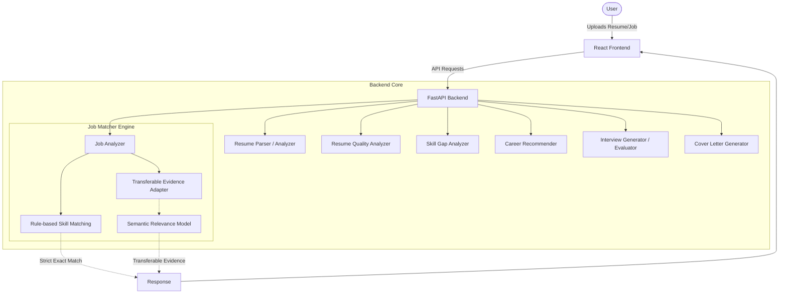

# CareerLens AI

CareerLens AI is an intelligent, AI-assisted career analysis platform designed to bridge the gap between job seekers' resumes and specific job requirements. By combining a deterministic rule-based parsing engine with a fine-tuned machine learning semantic relevance model, CareerLens AI provides actionable insights, ATS-readiness heuristics, skill gap analysis, dynamically generated interview preparation, and tailored cover letter generation.

## Overview

CareerLens AI operates on a hybrid architecture that merges strict logical boundaries with semantic flexibility:
- **Rule-based exact skill matching**: Acts as the authoritative source for whether a candidate explicitly possesses a required technical skill.
- **ML semantic relevance**: Operates as a supporting intelligence layer. It never overwrites explicit skill matching but instead analyzes missing skills against project and experience descriptions to identify potentially relevant experience.
- **Transferable evidence analysis**: Evaluates context to highlight when a candidate's background demonstrates related competencies that, while not exact matches, are highly transferable to the missing requirement.

## Key Features

- **Resume Parsing & Analysis**: Extracts contact info, skills, education, projects, and professional experience from PDFs and Word documents.
- **Job Description Analysis**: Extracts structured job requirements, preferred skills, and responsibilities from text or PDF uploads.
- **Explicit Skill Matching**: Deterministic, rule-based matching engine providing a quantifiable Match Score.
- **Transferable Evidence**: Leverages a fine-tuned semantic model to detect when unlisted required skills might be satisfied by closely related experience.
- **Skill Gap Analysis**: Computes explicit coverage metrics and identifies precise gaps in both required and preferred skill sets.
- **Career Recommendations**: Recommends potential career paths and upskilling opportunities based on the identified gaps.
- **Interview Preparation**: Dynamically generates tailored interview questions based on the candidate's resume and target job.
- **Answer Evaluation**: Provides real-time, interactive assessment and feedback on user-provided interview answers.
- **Cover Letter Generation**: Automatically drafts a targeted cover letter bridging the candidate's proven experience with the job description.
- **ATS Readiness**: Provides a heuristic resume quality score evaluating formatting, density, and action-verb usage.

## System Architecture



*Note: The Semantic ML model is strictly used as supporting evidence and does not replace explicit skill matching.*

## Tech Stack

**Backend:**
- Python 3
- FastAPI & Uvicorn (REST API)
- PyMuPDF (`pymupdf`) (PDF parsing)
- `python-docx` (Word parsing)

**Machine Learning:**
- PyTorch
- `sentence-transformers`
- `scikit-learn`
- Fine-tuned `all-mpnet-base-v2` model

**Frontend:**
- React 19
- React Router
- Vite
- HTML5 / CSS3

## Machine Learning

### Semantic Relevance Model
A purely rule-based system is highly brittle—if a job requires "PostgreSQL" and a candidate lists "Designed relational databases using MySQL and complex SQL", a strict ATS parser drops the candidate. CareerLens AI solves this by introducing a semantic layer.

However, **semantic similarity should never replace exact skill matching**. A candidate who knows "Docker" does not automatically know "Kubernetes". Therefore, CareerLens AI uses the ML model strictly to find *transferable evidence* for explicitly missing skills, rather than blindly inflating the candidate's match score.

### Fine-Tuned MPNet Model
- **Base Model**: `sentence-transformers/all-mpnet-base-v2`
- **Training Approach**: Fine-tuned using Contrastive Loss on a curated dataset mapping job requirements to resume text snippets.
- **Threshold**: Calibrated to `0.50` to balance precision and recall.

### Internal Held-Out Benchmark
Evaluated on an internal hold-out test set of 30 challenging skill-evidence pairs:

**Baseline MPNet:**
- Accuracy: 86.7%
- Precision: 80.0%
- Recall: 100.0%
- F1 Score: 88.9%

**Fine-Tuned MPNet:**
- Accuracy: **90.0%**
- Precision: **84.2%**
- Recall: **100.0%**
- F1 Score: **91.4%**
- False Positives: 3
- False Negatives: 0

*Important Note: This is an internal held-out benchmark and not a guarantee of real-world production performance. The semantic model can still fall for lexical traps (e.g., confusing adjacent technologies like React vs Angular, or Kubernetes vs Docker). For this reason, exact skill ownership remains strictly rule-based.*

## Transferable Evidence

**What it means:** Transferable evidence highlights when a candidate's background demonstrates related competencies that are highly transferable to a missing requirement.
**What it does NOT mean:** It does not confirm skill ownership. The skill remains technically "missing".

Examples of classification outputs:
- **Missing: PostgreSQL | Resume: MySQL/SQL** → *Potentially Transferable*
- **Missing: Kubernetes | Resume: Docker** → *Related, but Not Equivalent*

## API Endpoints

| Method | Path | Purpose |
|--------|------|---------|
| `GET` | `/` | API health check |
| `POST` | `/resume/upload` | Parse resume text/PDF/Word into structured data |
| `POST` | `/resume/quality` | Generate a heuristic ATS readiness score |
| `POST` | `/job/analyze` | Compare resume data against a text job description |
| `POST` | `/job/analyze-upload` | Compare resume data against a PDF job description |
| `POST` | `/skills/gap-analysis` | Compute coverage metrics and specific skill gaps |
| `POST` | `/career/recommendations` | Generate upskilling and career trajectory advice |
| `POST` | `/interview/questions` | Generate tailored interview questions |
| `POST` | `/interview/evaluate` | Evaluate a specific interview answer |
| `POST` | `/interview/summary` | Generate an aggregate interview performance summary |
| `POST` | `/cover-letter/generate` | Draft a targeted cover letter |
| `POST` | `/ml/relevance` | Evaluate semantic relevance of skills (Internal ML endpoint) |

## Project Structure

```text
CareerLens-AI/
├── backend/
│   ├── data/                 # Evaluation datasets & ML training files
│   ├── ml/                   # Machine learning models, training, and API adapters
│   │   └── models/           # Local model binaries (Git-ignored)
│   ├── main.py               # FastAPI entry point & routes
│   ├── job_analyzer.py       # Authoritative rule-based matching engine
│   ├── resume_parser.py      # PDF/Docx parser
│   ├── interview_*.py        # Interview logic controllers
│   └── ...                   
├── frontend/
│   ├── src/
│   │   ├── components/       # Reusable React UI components
│   │   ├── pages/            # View routers (JobMatcher, SkillGap, etc.)
│   │   ├── api.js            # Fetch wrappers for backend endpoints
│   │   ├── App.jsx           # Main React application
│   │   └── index.css         # UI Styling
│   ├── package.json
│   └── vite.config.js
├── .gitignore
└── README.md
```

## Installation

**Prerequisites:** Python 3.10+ and Node.js.

1. **Clone the repository:**
   ```bash
   git clone https://github.com/mdmahayalamhasib/CareerLens-AI.git
   cd CareerLens-AI
   ```

2. **Setup the Backend:**
   ```bash
   cd backend
   python -m venv .venv
   .venv\Scripts\activate
   pip install -r requirements.txt
   ```
   *(Note: The HuggingFace `datasets` package is excluded by design due to local Windows security policies. PyTorch and Sentence-Transformers are strictly used.)*

3. **Start the FastAPI Server:**
   ```bash
   uvicorn main:app --reload --port 8000
   ```
   The API will be available at `http://127.0.0.1:8000`. Swagger UI is available at `/docs`.

4. **Start the Frontend:**
   ```bash
   cd ../frontend
   npm install
   npm run dev
   ```

5. **Open the App:** Navigate to the URL provided by Vite (e.g., `http://localhost:5173`).

## Usage Workflow

1. **Upload Resume**: Start at the Dashboard or Resume Analysis tab to upload a PDF or Docx resume.
2. **Analyze Resume**: Review the extracted skills, ATS score, and parsed projects.
3. **Upload Job Description**: Paste a target job description or upload a Job PDF in the Job Matcher tab.
4. **Review Match**: Examine the exact matched skills and missing skills.
5. **Review Transferable Evidence**: Inspect ML-detected transferable experience for missing skills.
6. **Analyze Skill Gaps**: Navigate to the Skill Gap tab for precise percent coverage analysis.
7. **Get Recommendations**: Review upskilling and career trajectory advice.
8. **Practice Interview**: Generate targeted questions and practice your answers.
9. **Generate Cover Letter**: Create an automated cover letter based on your matched experience.

## Testing

The platform employs a multi-tiered regression strategy:
- **Backend Regression**: Full end-to-end simulation of the user journey via `fastapi.testclient`.
- **Frontend Production Build**: Strict Vite compilation verifying module integrity.
- **ML Relevance Tests**: Deterministic unit tests evaluating model bounds.
- **Transferable Evidence Tests**: Rule-based ML adapter tests verifying that the model never overwrites strict skill arrays.
- **Shadow Evaluation**: Full pipeline test tracking F1 scores against the 30-pair hold-out dataset.
- **Responsive UI Verification**: Flexbox layouts tested from 1440x900 desktop down to 390x844 mobile.

## Model File / GitHub Note

Because the fine-tuned `all-mpnet-base-v2` PyTorch and Safetensors binaries exceed standard Git file size limits (~418MB), the `backend/ml/models/` directory is strictly ignored via `.gitignore`. The model binaries are not downloadable directly from this repository. However, all ML integration logic, evaluation artifacts, and training configuration files remain fully accessible in the source code.

## Limitations

- **ATS Score**: The Resume Quality score is a heuristic tool, not a guarantee of passing proprietary enterprise Applicant Tracking Systems (e.g., Workday, Taleo).
- **Semantic ML Traps**: The model can still confuse adjacent technologies in complex contexts.
- **Deterministic Parsing**: Rule-based skill extraction may occasionally miss highly non-standard formatting.
- **Dataset Size**: The internal ML evaluation benchmark is small (30 pairs) and is not yet validated against a massive external production dataset.

## Future Improvements

- Evaluate the semantic model on a larger external production dataset.
- Implement harder negative sampling during contrastive loss training to further minimize lexical traps (e.g., React vs Angular).
- Introduce authentication and database persistence for users to save multiple resumes and job matches.
- Deploy the application to a cloud provider with an asynchronous background task queue (e.g., Celery/Redis) for PDF parsing and ML inference.
- Expand explainable AI matching directly in the UI.

## License

License: Not specified.

## Development Status

**Status: Core platform implemented and fully regression-tested.**
The core backend processing pipeline, semantic integration, and frontend routing are complete and strictly validated.
